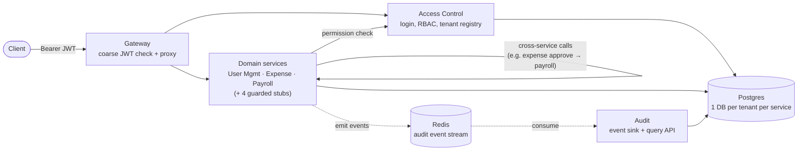
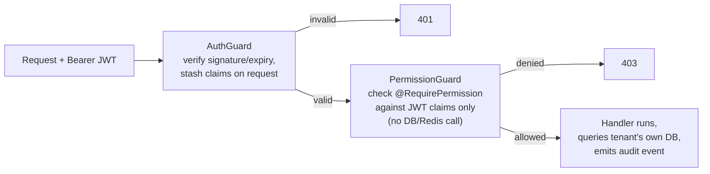

# Architecture Diagram

## High-level design

Every service (Access Control, the domain services, and Audit) is built on one shared library,
`@platform/auth-kit`, which owns JWT verification, permission checking, tenant-DB connection
routing, and audit emission — written and tested once, not duplicated per service.

## Important low-level detail: the two-guard auth chain

This is the one piece of internal mechanics worth seeing explicitly — it's what runs on
*every single guarded request*, in every service:

Authentication (AuthGuard) and authorization (PermissionGuard) are deliberately separate,
composable guards. The permission check is a **fast path** — a pure JWT-claims check, no network
call — which is why a revoked role can stay valid until the token expires (~15 min); see
[assumptions-and-tradeoffs.md](./assumptions-and-tradeoffs.md) for that tradeoff and the slower,
authoritative check that exists but isn't wired into any live route yet.

## Notes

- The Gateway injects no trusted internal headers — every downstream service independently
  re-verifies the full JWT itself, so a compromised gateway can't silently grant access.
- "1 DB per tenant per service" means physically separate Postgres databases, not a shared
  schema with a `tenant_id` column — see [schema-diagram.md](./schema-diagram.md) for the actual
  tables and [design-document.md](./design-document.md) §3 for why.
- Full endpoint-by-endpoint traffic (which service calls which, exact routes, ports) is in
  [sequence-diagrams.md](./sequence-diagrams.md) and [api-examples.md](./api-examples.md) —
  kept out of this diagram on purpose to keep the HLD readable.
