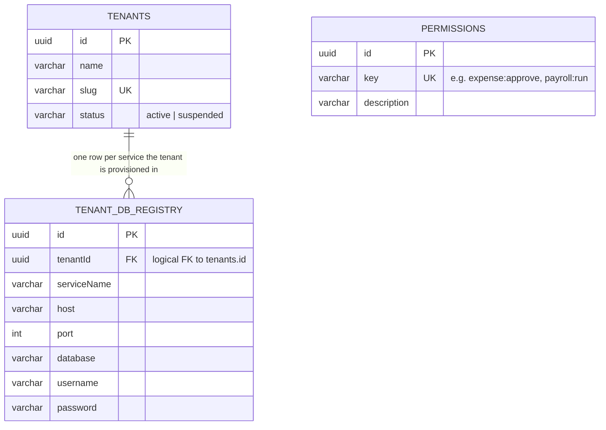
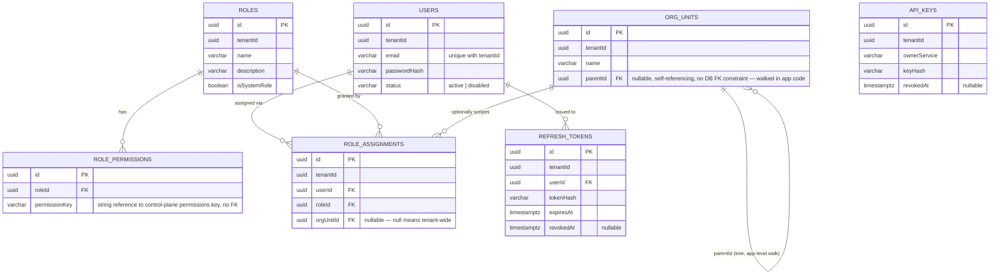
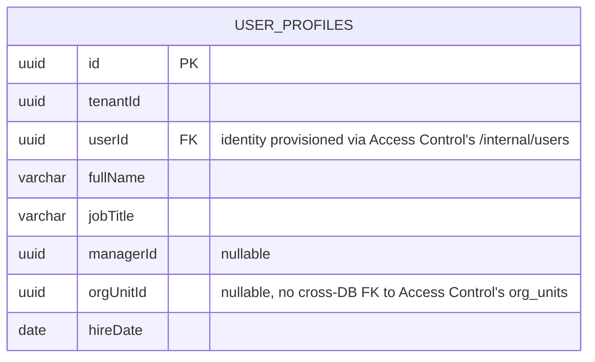
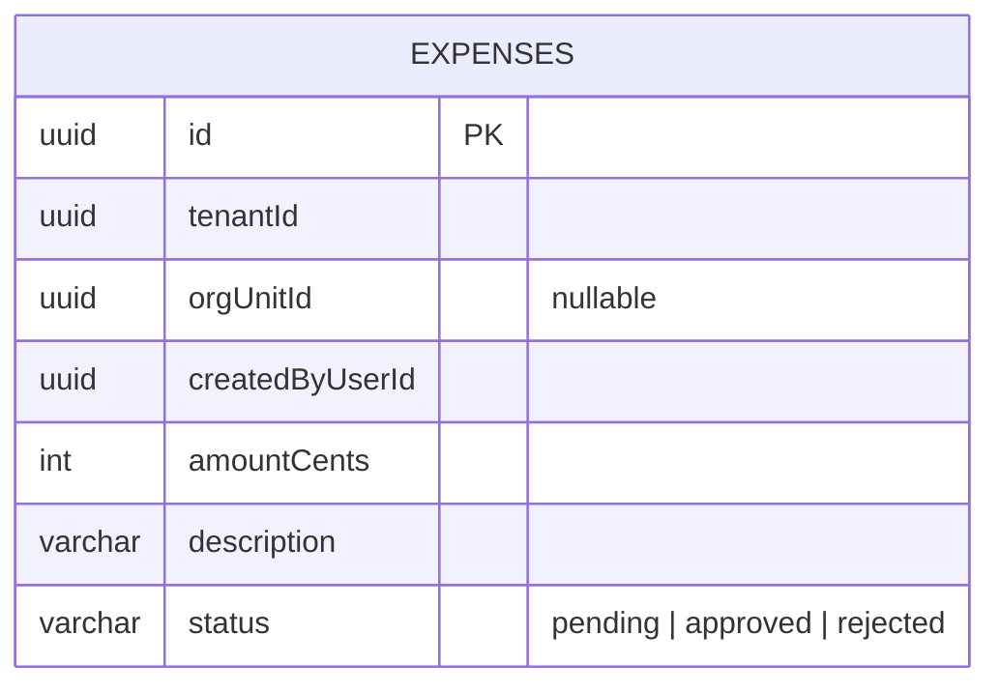
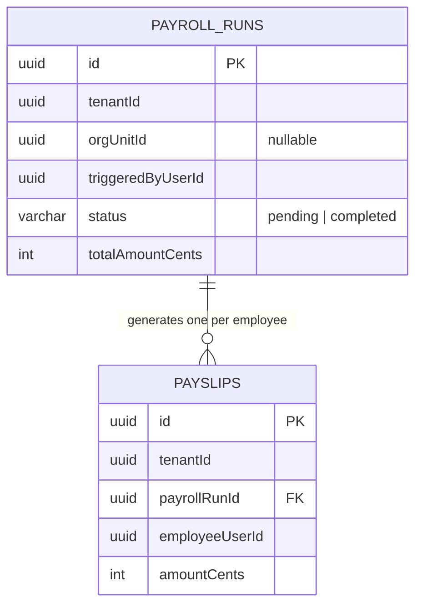
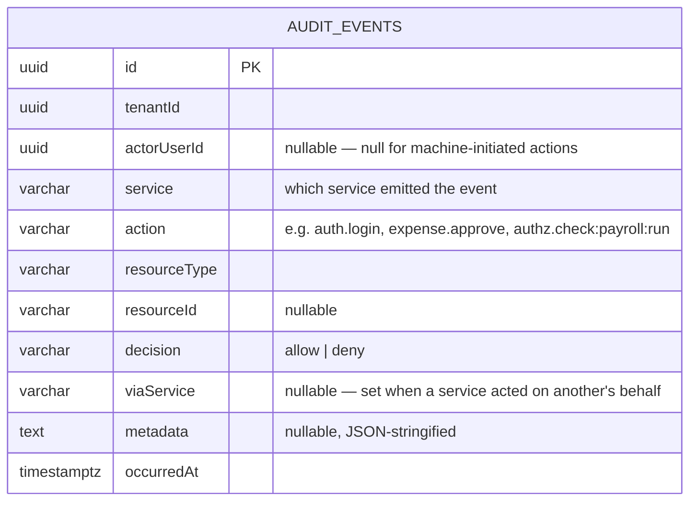

# Schema Diagrams

Every entity below is taken directly from the TypeORM entity definitions in the codebase. Column
names match the actual `@Column()` declarations.

## Control-plane database (one shared instance, all tenants)

`PERMISSIONS` is a global catalog, identical for every tenant, seeded once by migration (16 keys:
`user:manage`, `expense:create/approve/read`, `payroll:run/read`, `report:create/read`,
`workflow:create/advance`, `notification:send/read`, `invoice:create/read`, `role:manage`,
`audit:read`). There is **no foreign key** from a tenant DB's `role_permissions.permissionKey`
back to this table — they live in physically different databases, so the reference is by string
value only.

## Access Control — per-tenant database

## User Management — per-tenant database

## Expense Management — per-tenant database

## Payroll — per-tenant database

## Audit — per-tenant database

## Cross-database relationships (by value, not by FK)

Because every service owns a physically separate database, several logical relationships exist
only as matching UUID/string values, never as enforced foreign keys:

- `role_permissions.permissionKey` (Access Control tenant DB) ↔ `permissions.key` (control-plane
  DB) — a typo'd key silently matches nothing rather than failing a constraint.
- `user_profiles.userId` (User Management) ↔ `users.id` (Access Control) — set once at profile
  creation via a cross-service call; no distributed transaction, so a `UserProfile` save failure
  after a successful identity call would orphan the identity.
- `expenses.orgUnitId` / `payroll_runs.orgUnitId` / `user_profiles.orgUnitId` ↔ `org_units.id`
  (Access Control) — referenced by value only.
- `tenant_db_registry.tenantId` (control-plane) ↔ `tenants.id` (control-plane, same DB but no
  declared FK).
