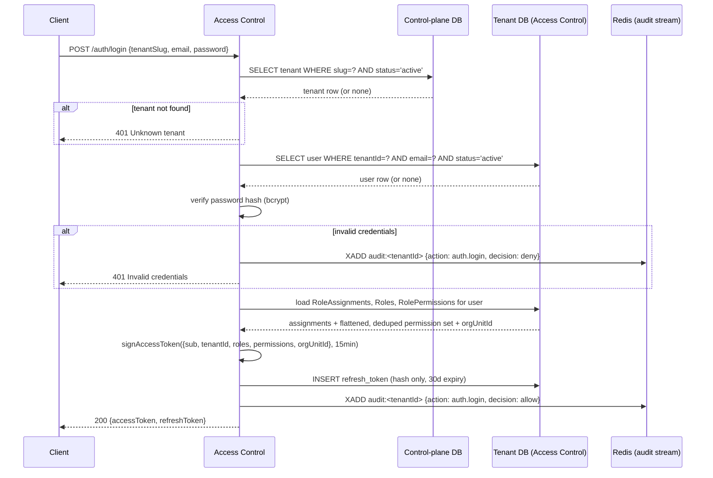
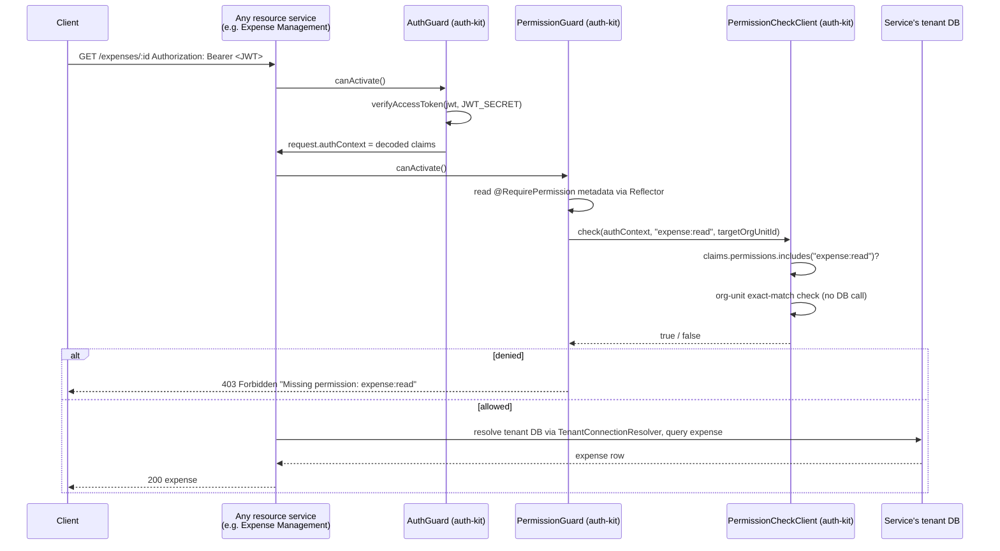
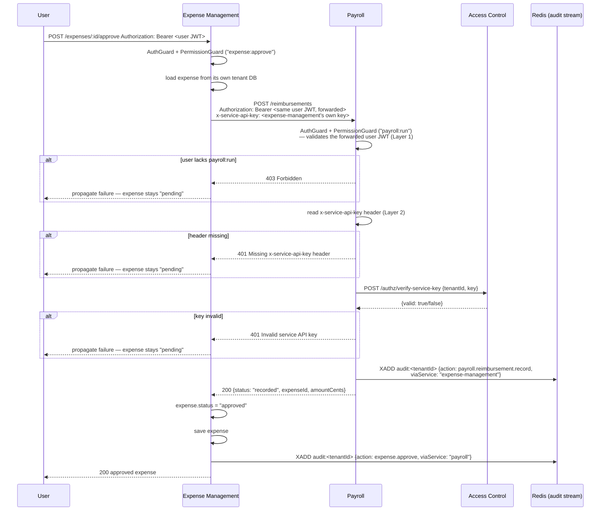
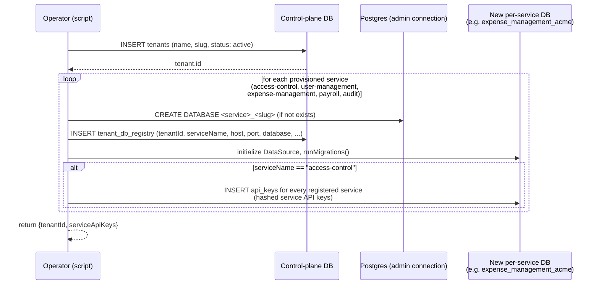
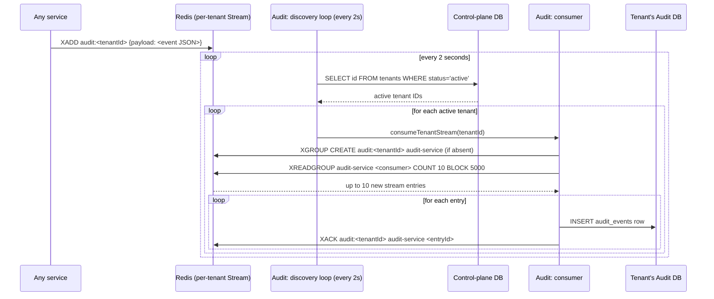

# Sequence Diagrams

## 1. Login / JWT issuance

## 2. Authenticated request → permission check (fast path)

## 3. Cross-service call: expense approval → payroll reimbursement

## 4. Tenant provisioning (`scripts/provision-tenant.ts`)

_Reporting, Workflow, Notification, and Invoice Management are absent from the provisioned-service
list — they never receive a database, which is why they remain stubs._

## 5. Audit event consumption

